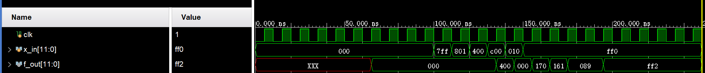
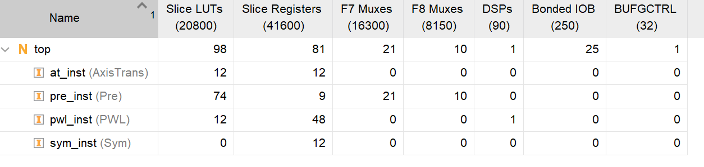
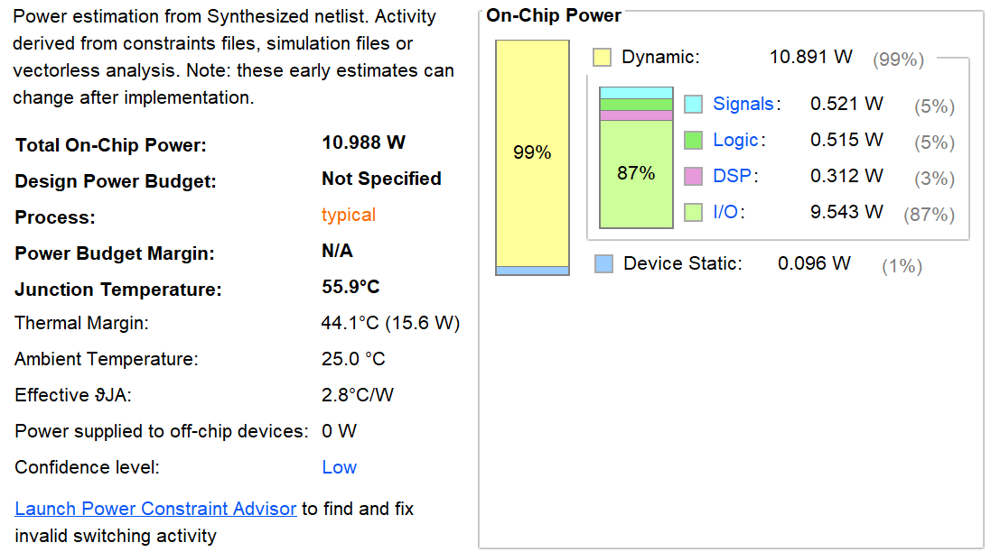
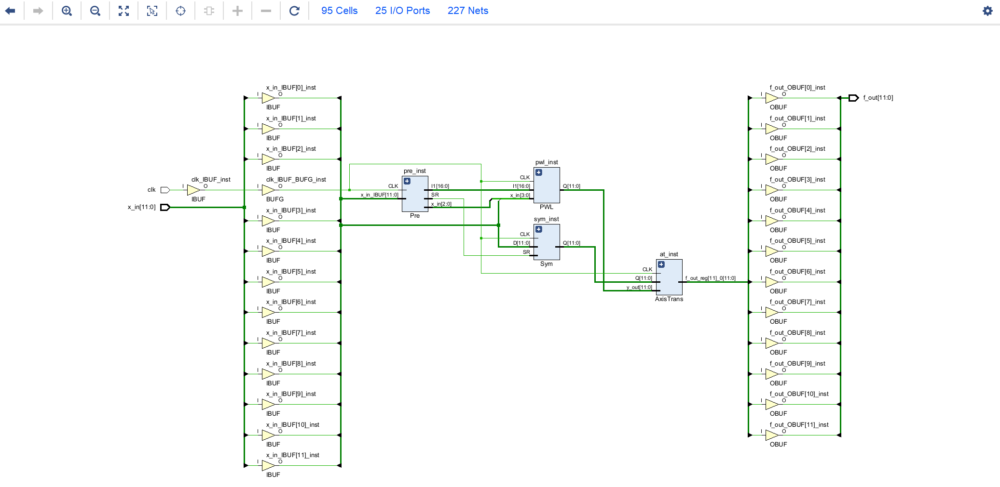

# code

[love-sabers/Flexible-Symmetry-Aware-Architecture](https://github.com/love-sabers/Flexible-Symmetry-Aware-Architecture)

# simulation 

tb_top.v

行为正常

输出落后输入3周期

# Synthesis

## Utilization

## power

## Schematic

